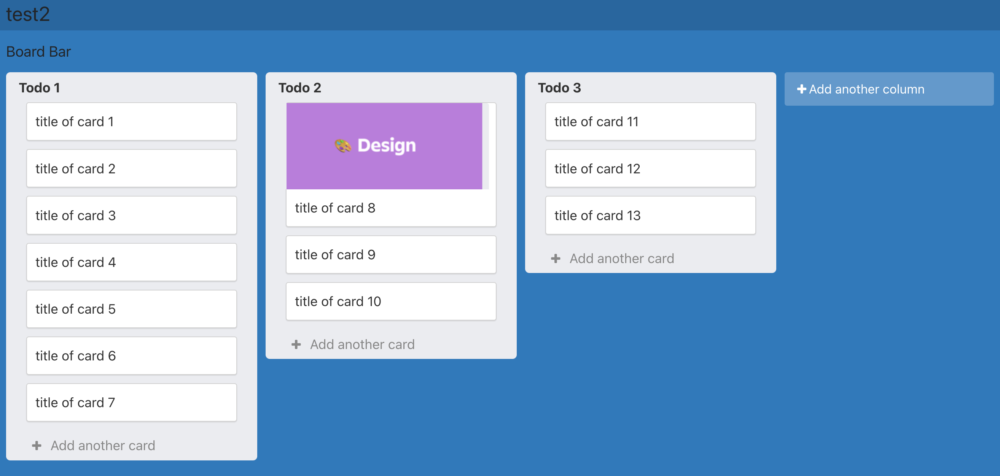

# Introduction: 
Mello is a project management tool that utilizes the kanban framework. Allowing users to organize their work and personal project in one application. Take the stess away and keep it Mello!

# Technologies Used: A list of all technologies, libraries, APIs, etc. used in the project.

- Visual Sutdio Code
- Mongo DB
- Postman
- React
- Javascript
- CSS
- Bootstrap
- Express
- dotenv
- Mongoose
- bcrypt
- react-router-dom
- react-scripts
- JWS Tocken /Ajax
- react-smooth-dnd

# Getting Started: Links to the project's planning (Trello board) and the deployed app on Heroku.

ERD

Trello

https://trello.com/b/6l03VU8N/ga-project3-mello

[Heroku](https://ga-evelyn-mello.herokuapp.com/)

# Unsolved Problems: List any unsolved issues.

- Combining the backend with the frontend 
- Heroku Deployment

# Future Enhancements:

- Full CRUD functionality to all data entities 
- Styled UI
- Include Edit and readonly admin interface when sharing board
- utilize multi-user, real time communication
